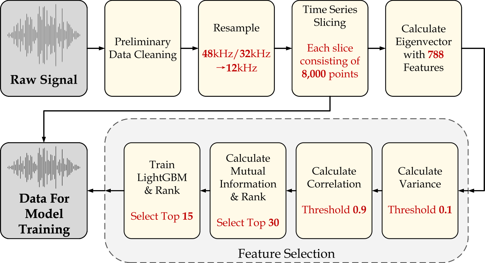
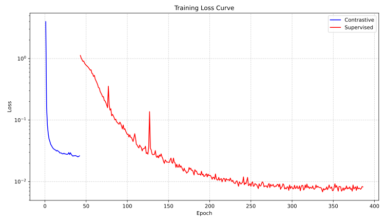
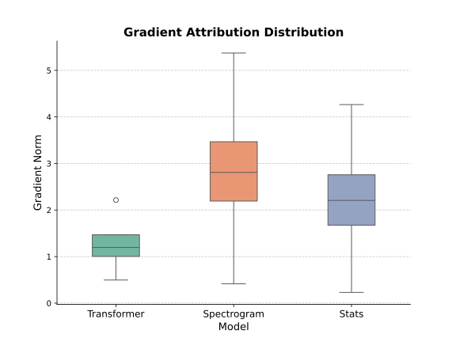

# VibCogTriNet

[**繁體中文**](./README.md) | [**英語(English)**](./README.en.md) | [**越南語(Tiếng Việt)**](./README.vi.md)

VibCogTriNet是一個可接受軸承振動波形而進行軸承故障檢測的深度學習模型，模型基於軸承振動波形時域、頻域、統計學三路融合特徵，綜合斷定軸承故障類型。該模型及其設計方案已用於參加2025年華為杯研究生數學建模大賽，訓練該模型所使用的數據集全部由大賽官方提供。

---

### **數據處理工作流圖：**

---

### **模型架構圖：**

---

### **模型訓練損失下降曲線（前42個Epoch為對比學習，後344個Epoch是監督學習）**

---

### **模型正向傳播梯度範數盒圖**

通過梯度歸因的方法計算模型內三路特徵拼接後輸入至全連接分類層的梯度，可以得出這三類特徵對模型最後分類效果的「貢獻」程度。通過下圖可知在測試集上，時域、頻域、統計學三路特徵在全連接分類器第一層神經網絡上的梯度值分佈，三路特徵在網絡上的梯度均大於0，表明它們均對模型最終的分類做出了正面影響。

---

### **消融實驗結果：**

| Model                          | Accuracy     | F1-score     |
| ------------------------------ | ------------ | ------------ |
| _**VibcogTriNet**_             | _**0.9969**_ | _**0.9538**_ |
| VibcogTriNet-no-Transformer    | 0.9812       | 0.9501       |
| VibcogTriNet-no-SpectrogramCNN | 0.9289       | 0.9001       |
| VibcogTriNet-no-Stats          | 0.9794       | 0.9444       |

---

### **項目作者**

**Copyright &copy; 2025** [**何非凡**](https://faculty.lzjtu.edu.cn/chenmei/zh_CN/xsxx/2554/content/1835.htm) (英語：HE Feifan；越南語：HÀ Phi Phàm)、[**杜宇**](https://faculty.lzjtu.edu.cn/chenmei/zh_CN/xsxx/2554/content/1837.htm) (英語：DU Yu；越南語：ĐỖ Vũ)、[**楊莎莎**](https://faculty.lzjtu.edu.cn/chenmei/zh_CN/xsxx/2554/content/1836.htm) (英語：YANG Shasha；越南語：DƯƠNG Sa Sa)，[**蘭州交通大學電子與信息工程學院**](https://dxxy.lzjtu.edu.cn/) (英語：School of Electronic and Information Engineering, Lanzhou Jiaotong University；越南語：Đại Học Giao thông Lan Châu, Học Viện Điện Tử Và Công Nghệ Thông Tin)
